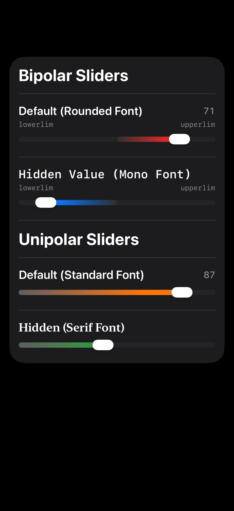
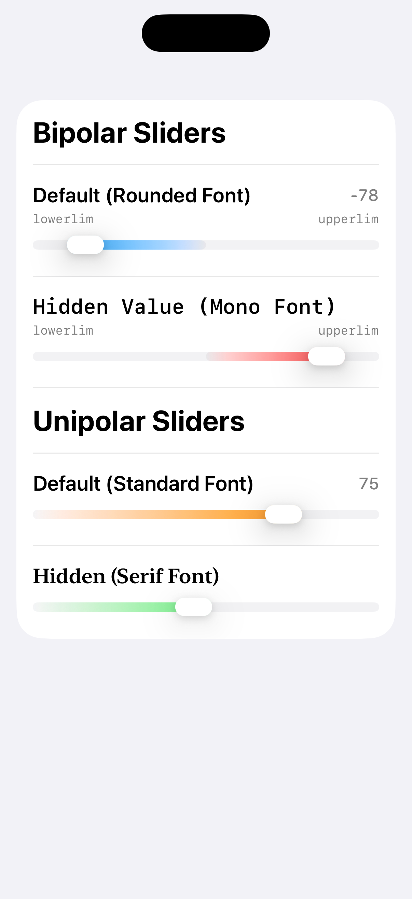

# GradientSliders

SwiftUI sliders for integer scales that need a clear visual direction.

`UnipolarSlider` is for one-direction values, such as `0...100`. `BipolarSlider` is for centered values, such as `-100...100`, where the meaning changes on either side of zero. The gradient is aesthetic and informational: it makes the direction of the scale easier to scan, but the core reason for the package is the distinction between unipolar and bipolar value models.

## Slider Previews

<table>
  <tr>
    <th>Dark Mode</th>
    <th>Light Mode</th>
  </tr>
  <tr>
    <td></td>
    <td></td>
  </tr>
</table>

## Why Two Sliders?

A unipolar scale measures more or less of one thing. Examples: intensity, confidence, completion, volume, brightness, progress, priority, or any score that starts at a lower bound and moves upward.

A bipolar scale measures movement between two opposing poles. Examples: cold to hot, negative to positive, oppose to support, left to right, reduce to increase, or any value where zero is a meaningful center point.

Keeping these as separate structs makes the call site honest. A unipolar control asks for one color and one range. A bipolar control asks for two colors, optional endpoint labels, and a range that can cross zero.

## Installation

Add the package in Xcode:

1. Open your project.
2. Select **File > Add Package Dependencies**.
3. Enter this repository URL:

```
https://github.com/va-desai-dev/GradientSliders
```

Then import the package where you use it:

```swift
import GradientSliders
```

## UnipolarSlider

Use `UnipolarSlider` when the value moves in one direction across a single concept.

```swift
import SwiftUI
import GradientSliders

struct SettingsView: View {
    @State private var confidence = 10

    var body: some View {
        UnipolarSlider(
            "Confidence",
            value: $confidence,
            in: 0...100,
            color: .orange,
            hideValueLabel: false,
            typeface: .standard
        )
        .padding()
    }
}
```

## BipolarSlider

Use `BipolarSlider` when the value has a center and two different meanings on either side.

```swift
import SwiftUI
import GradientSliders

struct PreferenceView: View {
    @State private var preference = 0

    var body: some View {
        BipolarSlider(
            "Temperature Preference",
            value: $preference,
            in: -100...100,
            step: 1,
            leftColor: Color(.systemBlue),
            rightColor: Color(.systemRed),
            lowerLimit: "cooler",
            upperLimit: "warmer",
            format: "%d",
            hideValueLabel: false,
            typeface: .rounded
        )
        .padding()
    }
}
```

## Options

Both sliders support integer bindings, custom ranges, step values, value formatting, hidden value labels, and SF typeface choices.

Available typefaces:

- `.standard`
- `.rounded`
- `.serif`
- `.mono`

Use `hideValueLabel: true` when the exact number should not dominate the decision and the user only needs to choose an approximate position.

## Requirements

- iOS 26+
- Swift 6.3+

## License

Source code is available for non-commercial use under the PolyForm Noncommercial License 1.0.0. See [LICENSE.md](LICENSE.md) for details.

Commercial use requires prior written permission.
